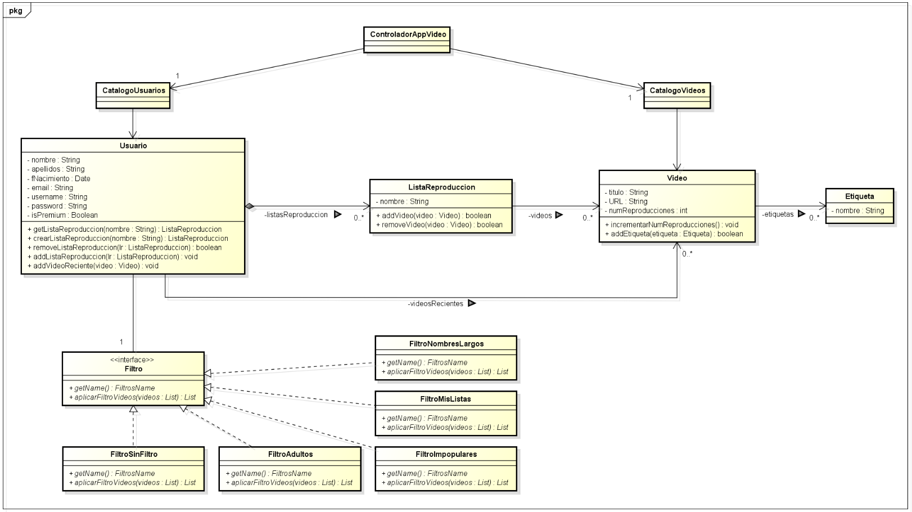
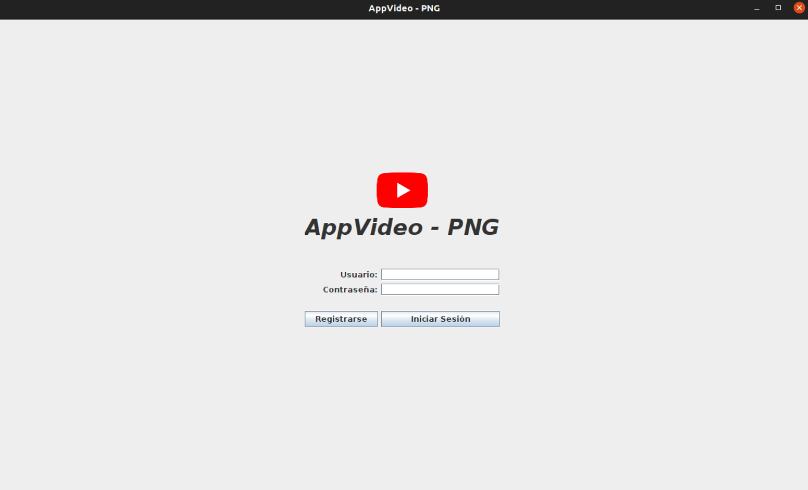
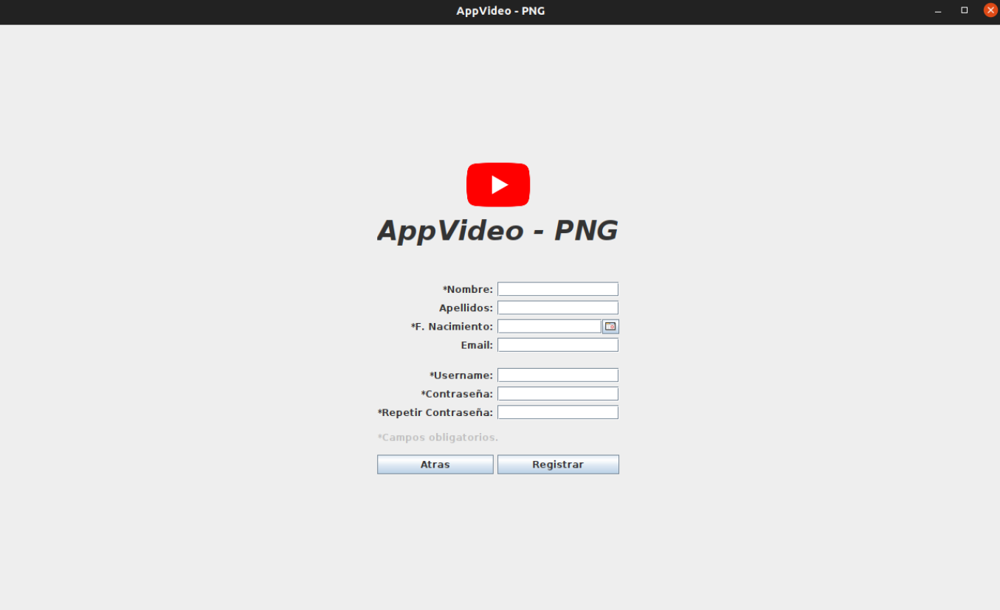
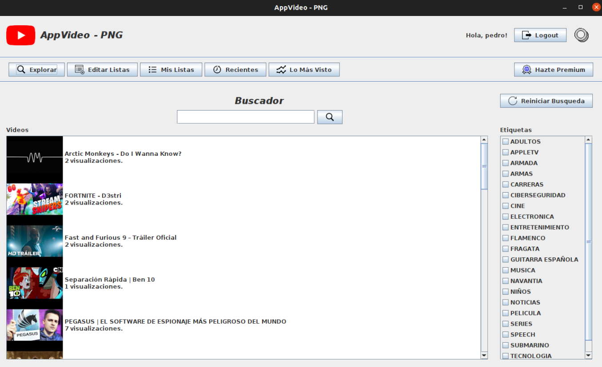
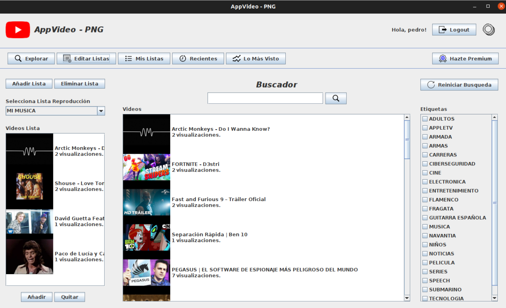
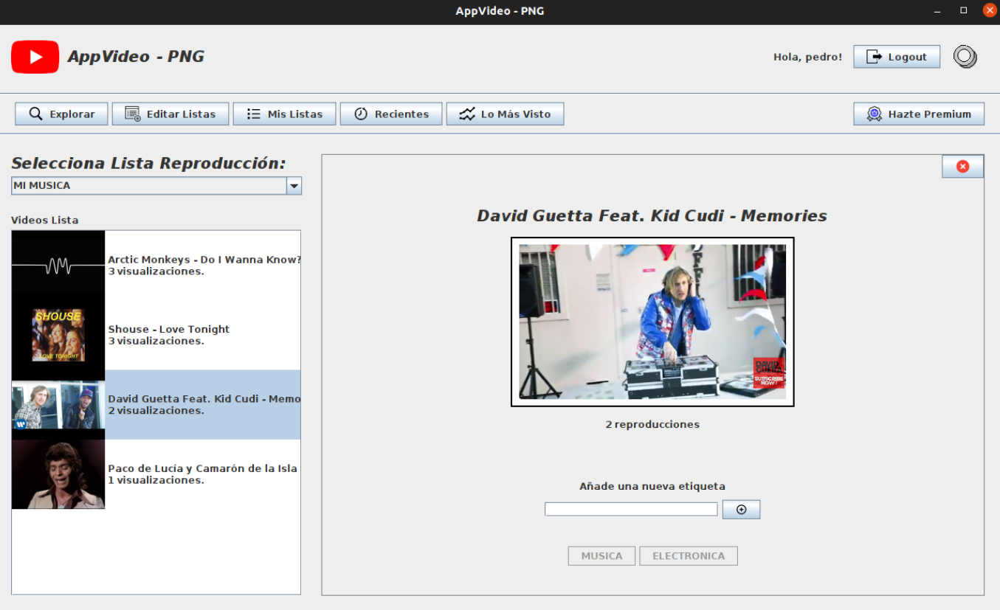
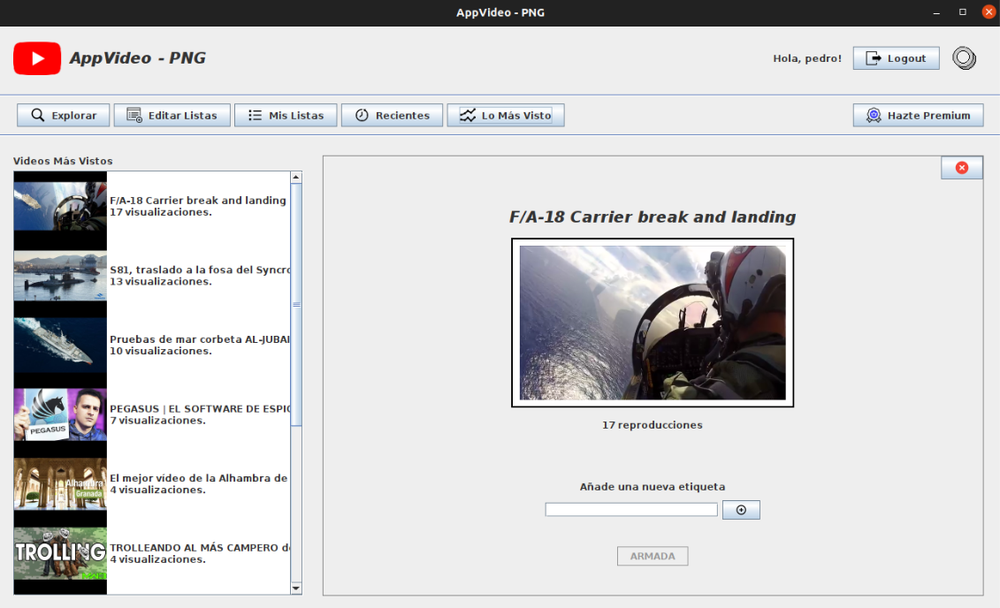
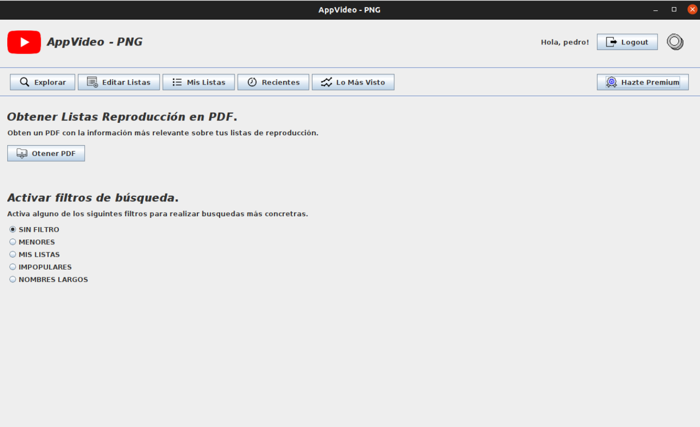
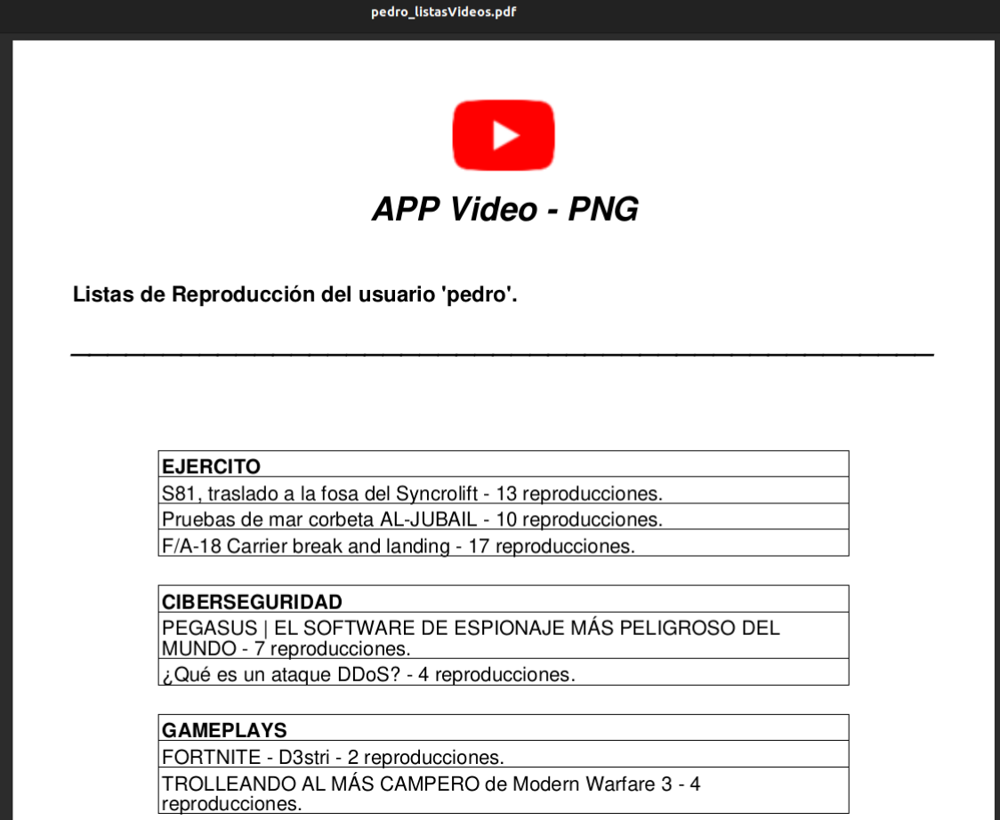

# AppVideo-DesktopApp

Aplicación de escritorio desarrollada como parte de la asignatura **Tecnologías de Desarrollo de Software (TDS)** (Universidad de Murcia, curso 2021/2022). Permite a los usuarios explorar, visualizar y organizar videos, incluyendo funcionalidades premium como filtros personalizados y exportación de información en PDF.

- [📄 Documentación completa.](./doc/Memoria_TDS.pdf)

## 🧭 Propósito

AppVideo permite a los usuarios:

- Visualizar videos.
- Crear listas de reproducción personalizadas.
- Aplicar filtros de búsqueda.
- Acceder a funcionalidades exclusivas como usuarios premium.

Inspirada en plataformas como **YouTube** o **Vimeo**, está adaptada como aplicación de escritorio educativa con arquitectura en tres capas y patrones de diseño.

## 📱 Funcionalidades

### Básicas

- Registro e inicio de sesión de usuarios.
- Visualización de videos y etiquetado personalizado.
- Búsqueda de videos mediante filtros (por texto y etiquetas).
- Creación, edición y eliminación de listas de reproducción.
- Gestión de videos dentro de listas personalizadas.
- Carga de videos desde archivos XML.
- Visualización de los videos más recientes.

### Premium

- Filtros avanzados:
  - **Menores:** excluye contenido etiquetado como "Adultos".
  - **Mis Listas:** oculta videos ya presentes en las listas del usuario.
  - **Impopulares:** oculta videos con menos de 5 visualizaciones.
  - **Nombres Largos:** oculta videos con títulos de más de 16 caracteres.
- Exportación de listas de reproducción a PDF.
- Acceso al ranking Top-10 de videos más vistos.

## 🗺️ Tecnologías y herramientas utilizadas


- **Java:** desarrollo del backend de la aplicación.
- **Java Swing:** construcción de la interfaz gráfica de usuario.
- **Maven:** gestión de dependencias y automatización de la compilación.
- **JUnit 4:** pruebas unitarias automatizadas sobre el dominio.
- **H2 Database:** base de datos embebida para persistencia local.
- **JCalendar:** componente externo para selección de fechas en formularios.
- **Cargador Videos:** JavaBean para cargar nuevos videos a AppVideo a través de archivos XML.
- **VideoWeb.jar:** integración para la reproducción de vídeos de YouTube en la interfaz Swing.

## 📦 Estructura general de la app

La aplicación sigue una arquitectura en tres capas, lo que facilita la separación de responsabilidades, el mantenimiento y la escalabilidad.

```
vista/         # Paneles de la interfaz Swing (login, registro, listas, premium, etc.)
controlador/   # ControladorAppVideo: fachada entre la GUI y la lógica de negocio
modelo/        # Entidades del dominio: Usuario, Video, ListaReproduccion, Etiqueta
persistencia/  # Adaptadores DAO y clases para la persistencia con H2
lanzador/      # Punto de entrada principal de la aplicación (main)
```

### 🧩 Diagrama de clases del dominio

El siguiente diagrama ilustra las principales entidades y relaciones del dominio:



## 🗃️ Arquitectura y patrones aplicados

- **Arquitectura en tres capas:** separación entre presentación, dominio y persistencia.
- **Patrones GRASP:**
  - _Controlador:_ `ControladorAppVideo` centraliza la lógica de la aplicación.
  - _Experto:_ la lógica de negocio reside en las clases del dominio.
  - _Creador:_ `Usuario` es responsable de crear listas de reproducción.
  - Se prioriza bajo acoplamiento y alta cohesión.
- **Patrones de diseño:**
  - _Singleton_ para controladores y catálogos.
  - _DAO_ para desacoplar el acceso a datos.
  - _Adaptador_ para traducir datos entre capas.
  - _Estrategia_ para filtros dinámicos de videos.

## 🧪 Testing

Pruebas unitarias implementadas con JUnit sobre las clases principales del dominio (**Video** y **ListaReproduccion**), validando:

- Inicialización y getters/setters.
- Gestión de duplicados en listas de reproducción.
- Añadir y eliminar videos correctamente.

## 💻 Capturas del frontend

- **Inicio de sesión**  
   

- **Registro de usuario**  
   

- **Explorar videos**  
   

- **Editar y gestionar listas**  
   

- **Mis listas de reproducción**  
   

- **Recientes**  
   

- **Top-10: Lo más visto**  
   

- **Panel Premium**  
   

- **PDF generado para usuario premium**  
   

## 👨‍💻 Autor

- Pedro Nicolás Gomariz - pedro.nicolasg@um.es

Proyecto desarrollado como entrega final de la asignatura **Tecnologías de Desarrollo de Software (TDS)** - Universidad de Murcia (curso 2021/2022).

Todos los derechos reservados © 2022.

El contenido de este repositorio, salvo que se indique lo contrario, está protegido por la legislación vigente sobre propiedad intelectual. El uso, reproducción o distribución total o parcial del material requiere el consentimiento expreso de los autores.
